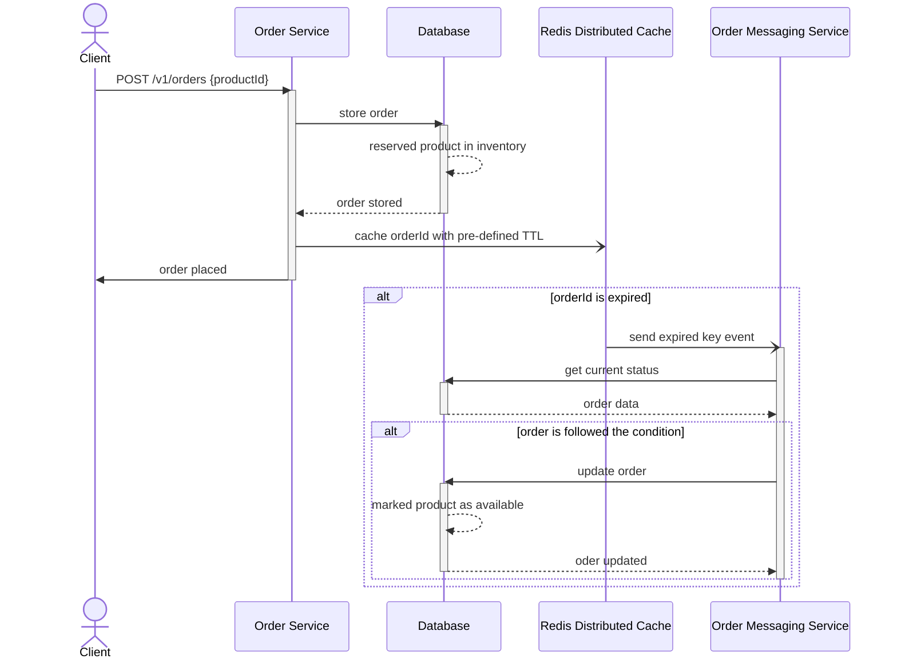

# Order Auto Cancellation

```mermaid
sequenceDiagram
    actor Client

    participant OS as Order Service
    participant DB as Database
    participant RDC as Redis Distributed Cache
    participant OMS as Order Messaging Service

    Client ->> OS: POST /v1/orders {productId}
    activate OS
    
    OS ->> DB: store order
    activate DB
    DB -->> DB: reserved product in inventory
    DB -->> OS: order stored
    deactivate DB

    OS -) RDC: cache orderId with pre-defined TTL

    OS ->> Client: order placed
    deactivate OS

    alt orderId is expired
        RDC -) OMS: send expired key event
        activate OMS

        OMS ->> DB: get current status
        activate DB
        DB -->> OMS: order data
        deactivate DB

        alt order is followed the condition
            OMS ->> DB: update order
            activate DB
            DB -->> DB: marked product as available
            DB -->> OMS: oder updated
            deactivate DB
        end

        deactivate OMS
    end

    
```